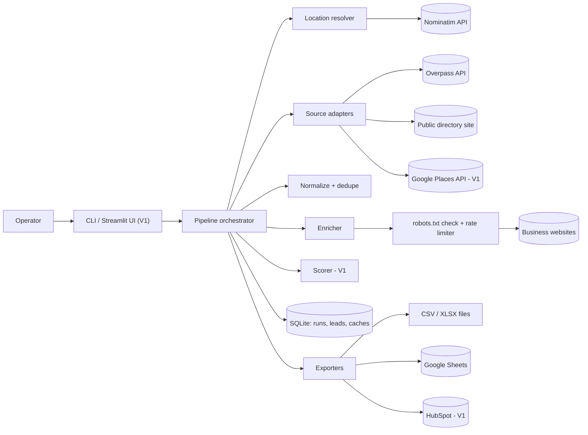
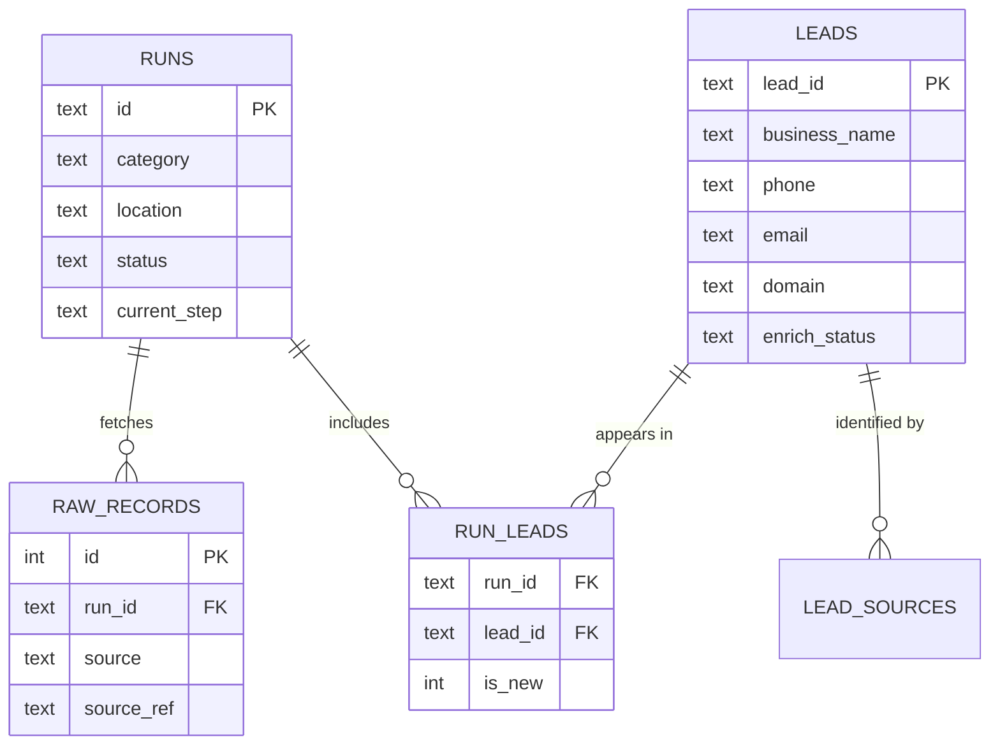

# LeadHarvest — Project Blueprint

**Project 1 of 4 · Lead scraper + CRM pipeline**
Version 1.1 · October 2026 · Status: ready to build

> **v1.1 changes** (from the review in `02_LeadHarvest_Review_and_Plan.md`): source-ref identity in dedupe, phone-match guard, non-empty match keys + city fallback, `first_seen_run_id`, FK pragma + cascades, suppression list with `forget`/`purge` as P0, per-origin robots.txt with per-hop redirect checks, RFC 9309 status handling, https→http fallback, SSRF guard in MVP, header-mapped RAW Sheets writes, export injection/phone-as-text rules, `--limit` buffering, way/bbox location resolution, JSON-LD extraction, directory adapter moved to V1, decisions D1–D5 (section 23).

> Type "dental clinics in Makati" and get a clean, deduplicated, enriched lead list in Google Sheets in minutes, collected politely and legally.

---

## How to use this blueprint with Claude Code

1. Create an empty project folder and save this file as `docs/BLUEPRINT.md`.
2. Copy the CLAUDE.md starter from **section 20** into `CLAUDE.md` at the repo root.
3. Build one phase at a time from **section 18**. Example prompt:
   `Read docs/BLUEPRINT.md sections 8, 9 and 18. Implement tasks 1.1–1.4 only. Run the tests, then stop and summarize what changed.`
4. Run `/clear` between phases. Tick the checkboxes as tasks finish.
5. Do not start V1/V2 features until the MVP Definition of Done (**section 19**) is met.

---

## 1. Product definition

| | |
|---|---|
| **What it is** | A Python command-line tool (plus an optional web UI in V1) that finds businesses by category and location, enriches them with contact details from their own websites, and exports clean leads to Google Sheets, CSV, or Excel. |
| **Problem** | Sales teams, agencies, and VAs spend hours copying business details from maps and directories into spreadsheets. Results are full of duplicates, missing emails, and inconsistent phone formats. |
| **Value** | A 100-lead list that takes a VA a full day takes about 10 minutes, with consistent formatting and no duplicates. |
| **Platform** | CLI on Windows/macOS/Linux. V1: Streamlit web UI. V2: scheduled runs on GitHub Actions. |
| **Expected scale** | 50–5,000 leads per run, one operator at a time. |
| **Authentication / roles** | None. A single operator runs it locally. |
| **Real-time / offline** | No / No (needs internet). |
| **Payments / admin panel** | No / No. |

### Assumptions
- You run it for clients and deliver a Sheet or file. Some clients may buy the tool itself.
- The default data source is **OpenStreetMap** (free, legal, open license). Coverage in Metro Manila is decent and weaker in provinces, so the architecture supports extra sources through adapters.
- The target market is B2B: published business contact details, not personal data about private individuals.

---

## 2. Goals and non-goals

**Primary goals**
- Search by category + location and return businesses with name, address, phone, website, and coordinates.
- Enrich from each business's own website: emails, extra phones, social profiles.
- Normalize and dedupe so each business appears once.
- Export to CSV, XLSX, and Google Sheets, re-runnable without duplicating rows in the Sheet.
- Be polite: obey robots.txt, rate-limit, identify with an honest User-Agent.
- Resume interrupted runs.

**Secondary goals**
- Lead scoring and "sales opportunity" flags.
- Email domain validation.
- CRM push (HubSpot free CRM).
- Simple web UI for non-technical clients.

**Non-goals (do not build)**
- Scraping sites behind logins, or scraping LinkedIn/Facebook profiles.
- CAPTCHA solving, proxy rotation to evade blocks, browser fingerprint spoofing.
- Sending emails. This is not a cold-email blaster.
- Collecting personal data of private individuals.
- User accounts, billing, multi-tenant SaaS.

---

## 3. Target users and buyers

| Persona | Who | Pain | What they buy from you |
|---|---|---|---|
| **Agency owner "Mark"** | Small web design/SEO agency (US, AU, or PH) | Needs prospects; manual list-building is slow | Weekly lead lists by niche + city, with a "no website" flag |
| **Sales lead "Jen"** | B2B supplier or SaaS (e.g., dental supplies) | Empty CRM; reps waste time researching | Clean leads pushed into HubSpot |
| **VA agency owner "Carlo"** | PH agency doing lead gen for foreign clients | Manual research doesn't scale | A tool his VAs can run themselves |
| **You (operator)** | Freelancer | Need proof of scraping + data skills | A fast, reliable, easy-to-demo tool |

**Skill level of end users:** clients mostly only open the Google Sheet. Only you (or a trained VA) runs the CLI.

---

## 4. Features

### MVP (P0)
| ID | Feature | Summary |
|---|---|---|
| F1 | Location resolver | City/area text → OSM area ID via Nominatim, cached locally |
| F2 | OSM source | Overpass query by category tags → raw business records |
| F4 | Normalization | Phones → E.164 (PH default), URLs, names, addresses |
| F5 | Deduplication | Match by source ref, guarded phone, domain + city, or name + street + city; merge fields |
| F6 | Website enrichment | Emails, phones, socials from homepage + up to 2 contact/about pages (incl. JSON-LD); obeys robots.txt per origin |
| F7 | Storage + resume | SQLite; each pipeline step is idempotent |
| F8 | Exports | CSV, XLSX, Google Sheets upsert (header-mapped) that preserves client-added columns |
| F9 | CLI + run summary | `run`, `search`, `enrich`, `export`, `resume`, `runs`, `categories`; progress bars and summary table |
| F19 | Privacy commands | `forget` (delete + suppress a domain/phone/email) and `purge` (retention) |

### V1 (P1)
| ID | Feature | Summary |
|---|---|---|
| F10 | Lead scoring | 0–100 score + flags (`no_website`, `no_https`, `social_only`, `free_email_provider`) |
| F11 | Email domain check | MX lookup to drop dead domains |
| F12 | Streamlit UI | Form → progress → table → download buttons; password-protected |
| F13 | HubSpot push | Find company by domain, update or create |
| F3 | Directory source (template) | Config-driven HTML scraper (CSS selectors in YAML) for a public directory you are allowed to scrape; Playwright optional for JS-rendered pages |
| F14 | Google Places source | Official API, better PH coverage; needs API key + billing account. **Blocked on decision D1** (storage terms) |

### V2 (P2–P3)
| ID | Feature | Summary |
|---|---|---|
| F15 | Scheduled monitoring | Weekly GitHub Actions run; "New since last run" tab |
| F16 | Batch mode | Many categories × cities from a CSV or Sheet |
| F17 | Website signals | Detect WordPress/Shopify/Wix, missing HTTPS, no mobile viewport (sales signals for agencies) |
| F18 | More directory adapters | Built per client request |

---

## 5. Core workflows

### W1 — Full run
1. Operator runs `leadharvest run --category dentist --location "Makati, Philippines" --limit 200`.
2. A run record is created (`status=running`, `current_step=search`).
3. The location is resolved through Nominatim (cached in `geo_cache`) to an OSM area or a bounding box.
4. Each enabled source is queried (fetching up to `limit × 1.5` to absorb unnamed records and duplicates); raw records are saved to `raw_records`.
5. Records are normalized, suppressed ones are dropped, the rest are deduped, upserted into `leads`, linked to the run, and truncated to `--limit`. Leads without a website get `enrich_status=no_website`.
6. Leads **linked to this run** with a website and `enrich_status=pending` are enriched concurrently and politely.
7. Leads are scored (V1).
8. Leads are exported to the configured targets.
9. The run is marked `completed` and a summary prints: found, new, merged duplicates, enriched OK/failed, % with email, export locations.

**Failure path:** any step error sets `status=partial`, stores the error (no secrets), and prints `leadharvest resume --run <id>`. Resume restarts from `current_step`.

**Edge cases:**
- Location not found → show the top 3 Nominatim matches and ask for a more specific location.
- Zero results → suggest synonyms from `categories.yaml` or a broader area.
- Overpass timeout → retry with backoff, then try the next Overpass URL.
- Result count above `--limit` → keep the first N, set `stats.truncated=true`, and warn. The count is known from an `out count;` pre-query.
- Ctrl+C → in-flight tasks are cancelled, the run is set to `partial`, and the resume command is printed (works on Windows; no signal handlers).

### W2 — Enrich only / retry
`leadharvest enrich --run latest [--retry-failed] [--refresh-days N]` enriches the run's pending leads, retries `timeout`/`http_error` leads, or re-enriches `ok` leads older than N days.

### W3 — Export only
`leadharvest export --run latest --to sheets,csv` upserts by `lead_id`. Managed columns are located **by header name**; any column whose header is not managed (client "Status", "Notes", "Owner") is never touched, wherever it sits.

### W5 — Privacy requests
- `leadharvest forget --domain x.com` (or `--phone`, `--email`) deletes matching leads and adds a suppression so future runs never re-collect them. Removing rows from already-delivered Sheets is a manual step and is printed as a reminder.
- `leadharvest purge --not-seen-days 180` deletes leads not seen in any run for N days.

### W4 — Add a directory adapter
1. Copy `config/directories/_template.yaml`.
2. Complete the scraping checklist in section 13 (robots.txt, ToS, public data).
3. Fill in selectors.
4. Run `leadharvest test-adapter <name> --pages 1` to print 5 parsed records.
5. Use it with `--sources osm,directory:<name>`. Start URLs and pagination must stay on the adapter's own site (checked by registered domain, or by hostname when the host has no known public suffix).

---

## 6. Tech stack

| Area | Choice | Why | Alternatives considered |
|---|---|---|---|
| Language | Python 3.12 | Best scraping/data ecosystem; same stack as your other 3 projects | Node.js (fine, but weaker for phone/data libraries) |
| Project + deps | uv | Fast installs, lockfile, manages Python versions | pip + venv, Poetry |
| CLI | Typer + Rich | Typed commands, progress bars, tables | argparse, Click |
| HTTP | httpx (async) | Timeouts, redirects, async concurrency | requests (sync only), aiohttp |
| HTML parsing | BeautifulSoup4 + lxml | Familiar, tolerant of broken HTML | selectolax (faster, less known) |
| JS rendering | Playwright (optional extra) | Only for JS-heavy pages; heavy install, so opt-in | Selenium (heavier, slower) |
| Retries | tenacity | Declarative backoff | Hand-written loops |
| Config | pydantic-settings | Validated `.env` config | python-dotenv alone |
| Models | pydantic v2 | Validation + typed records | dataclasses |
| Phones | phonenumbers | Correct PH mobile/landline parsing | Regex (error-prone) |
| Domains | tldextract | Handles `.com.ph` registered domains | urllib.parse (can't do this) |
| Storage | SQLite (stdlib `sqlite3`) | Zero setup, file-based, enables resume | Postgres (overkill for one operator) |
| Excel | openpyxl | Formatted XLSX output | pandas `to_excel` |
| Sheets | gspread + service account | Simple, free | Raw Google API client |
| MX check (V1) | dnspython | Small, reliable | — |
| UI (V1) | Streamlit | Fastest way to a clickable demo | Flask + HTML |
| CRM (V1) | HubSpot REST via httpx | No SDK needed | hubspot-api-client |
| Tests | pytest, respx, pytest-asyncio | Mock httpx; no network in tests | unittest |
| Quality | ruff (lint + format) | One fast tool | black + flake8 |

**Known disadvantages:** Playwright adds a few hundred MB of browser downloads (hence optional). SQLite allows one writer at a time, which is fine for a single operator.

---

## 7. Architecture

**Style:** a modular monolith — one Python package with clear modules and small interfaces. No services, no queues.



**How a run flows:** CLI parses input → pipeline creates a run → each step reads from and writes to SQLite → the next step starts from what's stored. Because every step persists its output, a crash loses at most the in-flight item, and `resume` picks up where it stopped.

**Key interfaces** (adding a source or exporter = one new file + registry entry):

```python
class Source(Protocol):
    name: str

    async def search(self, query: SearchQuery) -> list[RawBusiness]: ...


class Exporter(Protocol):
    name: str

    def export(self, leads: list[Lead], run: Run) -> ExportResult: ...
```

**Rules that prevent technical debt:**
- All SQL lives in `storage/repository.py`.
- All outbound HTTP clients are built by `http.py` (User-Agent, timeouts, retries, `Retry-After`). Website fetches go through `enrich/fetcher.py`; API calls go through a source or geo client. Never raw `httpx` calls scattered around.
- Every website fetch passes the SSRF guard and the robots.txt check **at each redirect hop**.
- Extractors and normalizers are pure functions (easy to test with fixtures).

---

## 8. Repository structure

```
leadharvest/
├── src/leadharvest/
│   ├── __init__.py
│   ├── cli.py                 # Typer app: run, search, enrich, export, resume, runs, categories, forget, purge, test-adapter (V1)
│   ├── config.py              # pydantic-settings; the only place env vars are read
│   ├── http.py                # shared httpx client factory: UA, timeouts, retries, Retry-After
│   ├── categories.py          # categories.yaml loader + close-match suggestions
│   ├── logging_setup.py       # Rich console + JSON-lines file logs (secret redaction)
│   ├── models.py              # SearchQuery, RawBusiness, Lead, Run, ExportResult
│   ├── pipeline.py            # step orchestration + resume
│   ├── geo/
│   │   └── nominatim.py       # location → OSM area id (cached, 1 req/s)
│   ├── sources/
│   │   ├── base.py            # Source protocol + registry
│   │   ├── osm_overpass.py    # MVP default source
│   │   ├── directory.py       # YAML-driven HTML directory scraper
│   │   └── google_places.py   # V1
│   ├── clean/
│   │   ├── normalize.py       # phones, URLs, names, addresses
│   │   └── dedupe.py          # match keys + merge rules
│   ├── enrich/
│   │   ├── fetcher.py         # polite async client: per-host delay, manual redirects, size cap, breaker
│   │   ├── netguard.py        # SSRF guard: reject private/loopback/link-local/reserved IPs
│   │   ├── robots.py          # robots.txt fetch/cache/check per origin (RFC 9309)
│   │   ├── extractors.py      # emails, phones, socials (pure functions)
│   │   ├── discovery.py       # find contact/about pages
│   │   └── enricher.py        # per-lead orchestration
│   ├── scoring.py             # V1
│   ├── storage/
│   │   ├── schema.sql
│   │   ├── db.py              # connection + simple versioned migrations
│   │   └── repository.py      # all SQL
│   └── exporters/
│       ├── base.py
│       ├── csv_export.py
│       ├── xlsx_export.py
│       ├── sheets_export.py
│       └── hubspot_export.py  # V1
├── config/
│   ├── categories.yaml
│   └── directories/
│       └── _template.yaml
├── app/
│   └── streamlit_app.py       # V1
├── tests/
│   ├── fixtures/
│   │   ├── overpass/          # saved JSON responses
│   │   ├── nominatim/
│   │   └── html/              # saved business pages (incl. obfuscated emails)
│   ├── unit/
│   └── integration/
├── docs/
│   └── BLUEPRINT.md           # this file
├── data/                      # gitignored: leads.db, exports/, logs/
├── secrets/                   # gitignored: service_account.json
├── .env.example
├── .gitignore
├── pyproject.toml
├── uv.lock
├── README.md
└── CLAUDE.md
```

---

## 9. Data model (SQLite)

Timestamps are ISO 8601 UTC strings. JSON columns are TEXT containing JSON.

### runs
| Field | Type | Req | Notes |
|---|---|---|---|
| id | TEXT | yes | PK, UUID4 |
| category | TEXT | yes | User input, e.g. `dentist` |
| location | TEXT | yes | User input, e.g. `Makati, Philippines` |
| area_id | INTEGER | no | Resolved OSM area ID |
| sources | TEXT (JSON) | yes | e.g. `["osm"]` |
| limit_n | INTEGER | yes | Default 200 |
| export_targets | TEXT (JSON) | yes | e.g. `["csv","xlsx"]`; `resume` exports to these |
| area_kind | TEXT | no | `area` / `bbox` |
| bbox | TEXT (JSON) | no | `[south, west, north, east]` when `area_kind=bbox` |
| area_name | TEXT | no | Resolved place name; used as city fallback |
| status | TEXT | yes | `running` / `completed` / `partial` / `failed` |
| current_step | TEXT | yes | `search` / `clean` / `enrich` / `score` / `export` / `done` |
| stats | TEXT (JSON) | no | Counts per step |
| error | TEXT | no | Last error message (never secrets) |
| created_at, finished_at | TEXT | | |

### raw_records
| Field | Type | Req | Notes |
|---|---|---|---|
| id | INTEGER | yes | PK autoincrement |
| run_id | TEXT | yes | FK → runs.id, ON DELETE CASCADE |
| source | TEXT | yes | `osm`, `directory:<name>`, `places` |
| source_ref | TEXT | yes | e.g. `node/123456` |
| payload | TEXT (JSON) | yes | Raw record for debugging/reprocessing |
| fetched_at | TEXT | yes | |
| | | | UNIQUE(run_id, source, source_ref) |

### leads
| Field | Type | Req | Notes |
|---|---|---|---|
| lead_id | TEXT | yes | PK, stable random ID `L-` + 12 hex chars (uuid4), assigned once |
| business_name | TEXT | yes | Display name |
| name_key | TEXT | yes | Normalized name for matching (indexed) |
| categories | TEXT (JSON) | yes | All categories that found it, e.g. `["dentist"]` |
| address, city, province | TEXT | no | |
| city_key | TEXT | no | Normalized city for matching ("Makati City" → `makati`) |
| city_source | TEXT | no | `osm` / `run_area` |
| street_key | TEXT | no | Normalized street for matching |
| country | TEXT | yes | Default `PH` |
| lat, lon | REAL | no | |
| phone | TEXT | no | Primary phone, E.164 (indexed) |
| phones_extra | TEXT (JSON) | no | Other E.164 numbers |
| email | TEXT | no | Best email (see ranking rules) |
| emails_extra | TEXT (JSON) | no | |
| website | TEXT | no | Normalized URL (scheme as given, else `https://`) |
| final_url | TEXT | no | URL after redirects during enrichment |
| https_ok | INTEGER (0/1) | no | Homepage served over HTTPS (http fallback used → 0) |
| domain | TEXT | no | Registered domain, e.g. `clinic.com.ph` (indexed) |
| facebook, instagram, linkedin, tiktok | TEXT | no | Profile URLs |
| opening_hours | TEXT | no | From OSM |
| sources | TEXT (JSON) | yes | Union of sources that found it |
| enrich_status | TEXT | yes | `pending` / `ok` / `no_website` / `robots_blocked` / `timeout` / `http_error` / `failed` |
| enriched_at | TEXT | no | |
| enrich_error | TEXT | no | Short reason for the last failure (no secrets) |
| score | INTEGER | no | V1 |
| flags | TEXT (JSON) | no | V1 |
| first_seen_run_id | TEXT | yes | Run that created the lead (drives `is_new`, survives resume) |
| first_seen_at, last_seen_at, updated_at | TEXT | yes | `last_seen_at` drives `purge` |

### lead_sources
| Field | Type | Notes |
|---|---|---|
| source | TEXT | `osm`, `directory:<name>`, `places` |
| source_ref | TEXT | e.g. `node/123456` |
| lead_id | TEXT | FK → leads.lead_id, ON DELETE CASCADE |
| | | PK(source, source_ref) — dedupe rule 0 |

### run_leads
| Field | Type | Notes |
|---|---|---|
| run_id | TEXT | FK → runs.id, ON DELETE CASCADE |
| lead_id | TEXT | FK → leads.lead_id, ON DELETE CASCADE |
| category | TEXT | The category this run searched (export shows this) |
| position | INTEGER | Link order; exports and enrichment follow it |
| | | PK(run_id, lead_id); inserted with `INSERT OR IGNORE` |

`is_new` is derived: `leads.first_seen_run_id = run_leads.run_id`. Storing it would break on resume.

### suppressions
| Field | Type | Notes |
|---|---|---|
| kind | TEXT | `domain` / `phone` / `email` |
| value | TEXT | Normalized (registered domain, E.164, lowercase email) |
| reason | TEXT | e.g. `removal request 2026-10-01` |
| created_at | TEXT | |
| | | PK(kind, value) |

### Schema v2 (migration `002_run_options.sql`)
- `runs.options TEXT (JSON)`: per-run switches such as `{"js": true, "mx": true}`, so `resume` keeps them.
- `mx_cache(domain TEXT PK, has_mail INTEGER, checked_at)`: MX results, 30-day TTL. Unknown (DNS error) results are not cached.

Migrations live in `storage/migrations/NNN_name.sql` and are applied in order; existing databases upgrade on open.

### Schema v3 (migration `003_website_signals.sql`)
- `leads.tech TEXT (JSON)`: site platforms detected on the homepage (e.g. `["wordpress"]`).
- `leads.mobile_viewport INTEGER (0/1)`: homepage declares `width=device-width`; 0 adds the `no_mobile_viewport` flag.

### Batch and monitor runs (no extra tables)
- A batch row is an ordinary run with `options = {"batch": <name>, "row": <n>}`; re-running the batch skips completed rows and resumes the rest.
- `monitor` uses batch name `<name>@<ISO year>-W<week>`, so each week starts fresh runs and a re-run in the same week resumes.
- "New since last run" = leads of this run not linked to the latest earlier **completed** run with the same category and area (`area_id`, else the location text). Exported to a `<tab> - new` Sheets history tab (`found_on` + managed columns, same header-mapped upsert) and `-new.csv/.xlsx` files.
- On GitHub Actions the SQLite file is carried between weekly runs as an AES-256-encrypted artifact (passphrase secret), because artifacts of public repositories are readable by any signed-in user.

### geo_cache / robots_cache
- `geo_cache(query_key TEXT PK, result JSON, cached_at)` — no expiry needed for city boundaries.
- `robots_cache(origin TEXT PK, robots_txt TEXT, status INTEGER, fetched_at)` — keyed by `scheme://host:port`, 24-hour TTL.

**Connection rules:** every connection runs `PRAGMA foreign_keys=ON` (SQLite defaults to off) and `PRAGMA journal_mode=WAL`. One connection per thread; async code writes on the event-loop thread only.



**Indexes:** `leads(phone)`, `leads(domain, city)`, `leads(name_key, street_key, city)`, `leads(last_seen_at)`, `lead_sources(lead_id)`, `raw_records(run_id)`, `run_leads(lead_id)`. No indexes on free-text columns like `address` (never filtered directly).

**Deletion:** deleting a run cascades to `raw_records` and `run_leads`; leads persist across runs so dedupe keeps working. Deleting a lead cascades to `run_leads` and `lead_sources`. `leadharvest purge --not-seen-days 180` deletes stale leads (retention); `leadharvest forget` deletes and suppresses.

---

## 10. Core logic specifications

### 10.1 Category mapping (`config/categories.yaml`)
```yaml
dentist:
  label: Dental clinics
  osm_tags: ["amenity=dentist", "healthcare=dentist"]
  synonyms: [dental clinic, dentists, dental]
restaurant:
  label: Restaurants
  osm_tags: ["amenity=restaurant"]
gym:
  label: Gyms and fitness centers
  osm_tags: ["leisure=fitness_centre"]
salon:
  label: Hair and beauty salons
  osm_tags: ["shop=hairdresser", "shop=beauty"]
law_firm:
  label: Law offices
  osm_tags: ["office=lawyer"]
real_estate:
  label: Real estate agencies
  osm_tags: ["office=estate_agent"]
```
Unknown categories fail fast with a list of close matches.

### 10.2 Location + Overpass query
1. Nominatim search `q=<location>&format=jsonv2&limit=3&countrycodes=<LH_DEFAULT_REGION>` (lowercased; omitted when `--any-country`).
2. Pick the first result and resolve it, in order:
   - `osm_type=relation` → area ID `3600000000 + osm_id`
   - `osm_type=way` → area ID `2400000000 + osm_id` (only closed ways form areas; if Overpass returns nothing, fall back to bbox)
   - otherwise → bounding box from Nominatim's `boundingbox` (`[south, north, west, east]` in Nominatim order; convert to Overpass `(south, west, north, east)`).
   `area_name` = Nominatim `name` (used as the city fallback).
3. Pre-query the count with the same filters and `out count;`, then fetch with a buffer of `ceil(limit × 1.5)`:
```
[out:json][timeout:90];
area(id:{area_id})->.searchArea;
(
  nwr["amenity"="dentist"](area.searchArea);
  nwr["healthcare"="dentist"](area.searchArea);
);
out center tags {fetch_n};
```
   Bbox form: replace `(area.searchArea)` with `({south},{west},{north},{east})` and drop the `area` line.
4. Tag mapping: `name` → business_name (skip records with no name); `phone`, `contact:phone`, `contact:mobile` → phones; `website`, `contact:website`, `url` → website; `email`, `contact:email` → email; `addr:housenumber` + `addr:street` + `addr:suburb` + `addr:city` → address; `addr:city` → city, else run `area_name` with `city_source=run_area`; `addr:province`/`addr:state` → province; `contact:facebook`, `facebook` → facebook; `contact:instagram`, `instagram` → instagram; `opening_hours`; coordinates from node or `center`; `source_ref` = `{type}/{id}`.

### 10.3 Normalization rules
- **Phone:** split on `;`, `,`, `/`; `phonenumbers.parse(raw, "PH")`; keep only `is_valid_number`; store E.164 (`0917 123 4567` → `+639171234567`, `(02) 8123-4567` → `+63281234567`). PH shorthands: a fragment of 1–4 digits after `/` replaces the last digits of the previous number (`(02) 8123-4567/68` → `+63281234567`, `+63281234568`); a fragment that is invalid alone is retried with the previous number's area code (`(02) 8123-4567 / 8765-4321` → both valid).
- **URL:** if there is no scheme, add `https://` (enrichment falls back to `http://` when https fails); lowercase host; strip `utm_*`, `fbclid`, `gclid`; drop trailing slash; accept only http/https. If the "website" is actually a Facebook/Instagram/TikTok/LinkedIn URL, move it to the social field and leave website empty. Social sites are never fetched.
- **Domain:** tldextract registered domain. Shared-hosting domains (`wixsite.com`, `blogspot.com`, `wordpress.com`, `business.site`, etc.) are *not* used for matching.
- **name_key:** casefold, remove punctuation, collapse spaces, drop legal suffixes (`inc`, `corp`, `corporation`, `co`, `ltd`, `opc`).
- **street_key:** casefold, expand/normalize `st.`→`street`, `ave.`→`avenue`, remove unit/floor numbers.

### 10.4 Deduplication
A new record matches an existing lead if **any** of these is true, checked in order; **the first rule that matches wins**. Every rule requires the compared values to be non-empty on both sides.
0. Same `(source, source_ref)` in `lead_sources`.
1. Same `phone` (E.164), **and** the names are similar (Jaccard token overlap of `name_key` ≥ 0.5, or one contains the other), **and** the coordinates are within `LH_PHONE_MATCH_RADIUS_M` (default 250 m) or either side has no coordinates. Both conditions are needed: chain branches often share an identical name *and* a hotline, and businesses in one building share a switchboard. Phones that already appear on ≥ `LH_SHARED_PHONE_MIN_NAMES` (default 3) leads with different `name_key`s are "shared" and never used for matching.
2. Same `domain` **and** same `city` (non-shared-host domain). City is compared by `city_key` (casefolded, "City of"/"City" stripped, so "Makati City" = "Makati").
3. Same `name_key` **and** same `street_key` **and** same `city_key`, unless both have coordinates more than the radius apart.

If a record matches one lead by an earlier rule and a *different* lead by a later rule, the earlier rule wins and the pair is counted in `stats.possible_duplicates` (logged with both lead IDs) for manual review. Records within one run are matched against leads inserted earlier in the same run.

**Merge rules:**
- `lead_id` never changes; `(source, source_ref)` is added to `lead_sources`.
- When the record is a refresh of the lead's **only** source record (same `(source, source_ref)`, and the lead has no other source refs), its non-empty fields **overwrite** the stored source fields. With several source records, overwriting would flip values between them on every run, so the next rule applies.
- Otherwise keep existing non-empty values and fill empty fields from the new record.
- Union list fields (`phones_extra`, `emails_extra`, `sources`, `categories`).
- If the website changes, `enrich_status` returns to `pending`.
- Re-enrichment adds newly found emails/phones/socials and re-ranks the primary email; it never removes values (use `forget`/`purge` for removal).

**Post-enrichment check:** after enrichment, leads in the run whose new phone/domain now matches another lead are reported in `stats.possible_duplicates`. They are not auto-merged in the MVP.
**Known limitation:** branches of the same chain in one city with one website merge into one lead. A `--keep-branches` flag is P2.

### 10.5 Website enrichment
Per lead with a website (only leads linked to the current run):
1. Check robots.txt for `/` on the website's origin using our User-Agent. Disallowed → `robots_blocked`, stop.
2. GET homepage: 15 s timeout, ≤ 2 MB, `text/html` only. Redirects are followed **manually** (≤ 5 hops); at each hop the target must pass the SSRF guard (section 13) and robots.txt for the target's origin, and the per-host delay applies to the target host. If the https URL fails with a connection/TLS error and the scheme was added by us or the site is http-only, retry once with `http://`. Store `final_url` and `https_ok`.
3. Extract emails, phones, socials, including schema.org JSON-LD (`LocalBusiness`/`Organization`/subtypes: `telephone`, `email`, `sameAs`).
4. If email or phone is still missing, discover up to 2 same-domain pages whose link text or path matches `contact|about|reach|get-in-touch|location|makipag-ugnayan` (contact first), check robots.txt, fetch, extract.
5. Save results and `enrich_status`.
6. With `--js` only: if visible text < 500 characters and nothing was found, render with Playwright (20 s timeout) and extract again.

**Email rules:**
- Sources: `mailto:` links first, then JSON-LD `email`, then regex over visible text.
- Deobfuscate only bracketed forms: `name [at] domain [dot] com`, `name(at)domain(dot)com`.
- Cloudflare-protected emails (`/cdn-cgi/l/email-protection`) are **not** decoded (decision D3); they are counted in `stats.protected_emails`.
- Emails, phones, and domains on the suppression list are discarded.
- Lowercase; drop matches ending in image extensions (`@2x.png`); drop junk domains (`example.com`, `sentry.io`, `wixpress.com`, `domain.com`).
- Ranking for the primary `email`: same registered domain as the website → free providers (`gmail.com`, `yahoo.com`, `outlook.com` — very common for PH SMEs) → others. Within a tier prefer `info@`, `contact@`, `hello@`, `sales@`.

**Phone rules:** `tel:` links + `phonenumbers.PhoneNumberMatcher(text, "PH")`; valid numbers only.

**Social rules:** keep profile URLs only; exclude share/intent/plugin links (`facebook.com/sharer`, `/plugins`, `/tr`, `twitter.com/intent`, `instagram.com/p/`).

### 10.6 Politeness rules (hard limits)
- User-Agent includes the project name and a contact email.
- `config.py` refuses to start if the User-Agent contains `example.com` or has no contact (`mailto:`, `@`, or `http`).
- ≥ 2 seconds between requests to the same host (config can raise, never below 1 s). The delay is keyed by host; requests to different hosts run concurrently.
- Global concurrency ≤ 5 by default.
- robots.txt (RFC 9309): any 4xx → allowed (no robots.txt); 5xx or unreachable → treated as fully disallowed. Cached per origin. If the origin itself refuses the connection (connect error/timeout on the robots.txt request), nothing is fetched from it, and the homepage step may retry the `http://` origin, which has its own robots.txt.
- Nominatim ≤ 1 request/second and cached; one Overpass query at a time; keep usage light.
- Honor 429 + `Retry-After` (capped at 60 s). After 3 consecutive 403/429 responses from a host, skip that host for the rest of the run.
- No CAPTCHA solving, proxies, or logins. Ever.

### 10.7 Google Sheets export
- Tab name: `{category} - {area_name}` (sanitized, ≤ 100 chars).
- Managed columns (default order for a new tab): `lead_id, business_name, category, phone, phones_extra, email, emails_extra, website, facebook, instagram, linkedin, tiktok, address, city, score, flags, opening_hours, lat, lon, sources, updated_at`. List values are written comma-separated.
- **Columns are located by header name, never by position.** Read row 1; for each managed header find its column. Managed headers missing from the sheet are appended after the last used column. Columns with any other header belong to the client and are never written, wherever they sit.
- Upsert: read row 1 and the `lead_id` column once → map `lead_id` → row number → one `batch_update` for existing rows (per managed column range) → one append for new rows.
- All writes use `valueInputOption=RAW`, so scraped text is never evaluated as a formula and `+63…` phones stay text.
- Rows a client deletes are re-appended on the next export (decision D4); documented in the README.
- Header row bold + frozen + filter. Back off on 429 (Sheets allows roughly 60 requests/minute per user).

### 10.7b CSV / XLSX export
- Same managed columns. Files are `{category}-{area}-{run_id[:8]}.csv|.xlsx` in `LH_EXPORT_DIR`.
- CSV: UTF-8 **with BOM** (so Excel reads non-ASCII names). Cells in non-phone columns that start with `=`, `+`, `-`, `@`, tab or CR are prefixed with `'` (formula-injection guard). Phones stay `+63…`; the README tells clients to open the XLSX in Excel.
- XLSX: every cell is written as a string except `lat`, `lon`, `score`; bold frozen header, auto-filter, column widths; a second sheet `About` carries the ODbL attribution and run metadata.

### 10.8 Scoring (V1)
| Signal | Points |
|---|---|
| Email found | 30 |
| Email on the business's own domain | +10 |
| Phone | 20 |
| Website | 15 |
| Any social profile | 10 |
| Street address | 10 |
| Opening hours | 5 |

Capped at 100. Flags: `no_website`, `no_https` (from `https_ok=0` after enrichment, never from the URL text), `social_only`, `free_email_provider`.

---

## 11. Configuration (`.env.example`)

```bash
# --- Identity (required) ---
LH_USER_AGENT="LeadHarvest/0.1 (+mailto:you@example.com)"

# --- Paths ---
LH_DB_PATH=data/leads.db
LH_EXPORT_DIR=data/exports
LH_LOG_DIR=data/logs

# --- Politeness & performance ---
LH_CONCURRENCY=5
LH_PER_DOMAIN_DELAY_SECONDS=2
LH_REQUEST_TIMEOUT_SECONDS=15
LH_MAX_RESPONSE_BYTES=2000000
LH_MAX_EXTRA_PAGES=2
LH_DEFAULT_REGION=PH

# --- Dedupe tuning (decision D5) ---
LH_PHONE_MATCH_RADIUS_M=250
LH_SHARED_PHONE_MIN_NAMES=3

# --- OpenStreetMap endpoints (comma-separated fallbacks; verify availability) ---
LH_NOMINATIM_URL=https://nominatim.openstreetmap.org/search
LH_OVERPASS_URLS=https://overpass-api.de/api/interpreter,https://overpass.kumi.systems/api/interpreter

# --- Google Sheets (optional) ---
GOOGLE_SERVICE_ACCOUNT_FILE=secrets/service_account.json
GOOGLE_SHEET_ID=

# --- V1 (optional) ---
GOOGLE_PLACES_API_KEY=
HUBSPOT_ACCESS_TOKEN=
LH_UI_PASSWORD=
```
`config.py` validates on startup and fails with a clear message when a required value is missing for the chosen command (e.g., `--to sheets` without `GOOGLE_SHEET_ID`), or when `LH_USER_AGENT` is still the placeholder. `LH_PER_DOMAIN_DELAY_SECONDS` below 1 is rejected.

---

## 12. Error handling and logging

| Error type | Behavior |
|---|---|
| `LocationNotFound` | User error: print suggestions, exit code 2 |
| `SourceError` (timeout, 5xx, 429) | Retry 3× with exponential backoff (tenacity), then next fallback URL, then run → `partial` |
| Enrichment error for one lead | Recorded in `enrich_status`; never stops the run |
| `ExportError` | Retry 3×; on failure run → `partial`, files already written are kept |
| Unexpected exception | Logged with traceback to file; short message on console; run → `failed` |
| Ctrl+C (`KeyboardInterrupt`) | Cancel in-flight tasks, run → `partial`, print the resume command, exit code 130 |
| Config error | Clear message naming the variable, exit code 2, no traceback |

**Logging:** console via Rich (human-readable) + JSON lines in `data/logs/run-<id>.jsonl`. Log step start/end, counts, URLs, status codes, durations.
**Never log:** API keys, service-account contents, tokens, full page HTML.

---

## 13. Security, legal, and compliance

**Secrets:** `.env` and `secrets/` are gitignored. The service account only has access to Sheets explicitly shared with it.

**Scraping checklist before adding any new site:**
- [ ] robots.txt allows the paths you need
- [ ] Terms of Service don't prohibit automated collection
- [ ] Data is public without login
- [ ] Rate ≤ 1 request / 2 seconds per domain
- [ ] User-Agent identifies you with a contact email

**Google Maps:** scraping Google Maps directly violates Google's terms. When clients ask for "Google Maps leads", offer OSM, public directories, or the official Places API (V1).

**Privacy:** collect only published business contact details. Under the Philippine Data Privacy Act (RA 10173), even business emails with a person's name can be personal data, so honor removal requests (`leadharvest forget --domain x.com`, which also suppresses future collection) and use the purge command for retention. Clients who email leads must follow applicable anti-spam laws (CAN-SPAM in the US; the Spam Act 2003 in Australia, which is stricter — it requires consent, though conspicuously published business addresses can give inferred consent for relevant offers); put this in your service terms.

**OpenStreetMap license:** OSM data is under the ODbL. Include "© OpenStreetMap contributors" in exports and README. Delivering an OSM-derived lead list to a paying client may count as conveying a derivative database with share-alike obligations; see decision D2 before pricing.

**Untrusted input:** scraped HTML is never executed; response size is capped; only http/https URLs on ports 80/443 (or the URL's explicit port) are fetched. **SSRF guard (MVP):** before every website request and at every redirect hop, resolve the host and refuse private, loopback, link-local, multicast, reserved and unspecified IPv4/IPv6 addresses (`enrich/netguard.py`). OSM `website` tags are untrusted input, and V1 hosts the tool on Streamlit Cloud.

**Exports:** Sheets writes use `RAW` input; CSV cells are escaped against formula injection (section 10.7b).

**Dependencies:** pinned in `uv.lock`; run `uv lock --upgrade` monthly and re-run tests.

---

## 14. Testing strategy

| Layer | What | Tools |
|---|---|---|
| Unit | normalize, dedupe, extractors, scoring, Overpass/Nominatim parsers | pytest + fixtures |
| Integration | Pipeline end-to-end with a fixture source → temp SQLite → CSV | pytest, respx (mock HTTP) |
| Exporter | Sheets upsert logic with a fake worksheet object | pytest |
| Live smoke | One real small query, marked `@pytest.mark.live`, skipped by default | pytest `-m live` |

**Must-have test cases:**
- Phones: `0917 123 4567` → `+639171234567`; `+63 917-123-4567` → same; `(02) 8123-4567` → `+63281234567`; `(02) 8123-4567/68` → two numbers; `12345` → rejected.
- Emails: `info [at] clinic [dot] ph` → `info@clinic.ph`; `logo@2x.png` ignored; `user@example.com` ignored; same-domain email ranked first; JSON-LD email extracted.
- Dedupe: same phone + similar names → merged; same phone + unrelated names far apart → **not** merged (chain hotline); `www.` vs no `www.` → same domain; shared-host domains never match; empty street on both sides → no rule-3 match; same name + street in different cities → not merged; re-processing the same raw records → 0 new leads.
- robots.txt disallow → `robots_blocked` and **no** page request made (assert with respx); also when the disallow is on a redirect target's origin.
- SSRF: a website resolving to `127.0.0.1`/`10.x`/`169.254.x` is never requested, including via redirect.
- https failure → http fallback → `https_ok=0`.
- Sheets upsert keeps a client "Notes" column untouched, including when the client reorders columns or a new managed column is added; `=HYPERLINK(...)` is written as RAW text.
- Resume: simulate a crash during enrich → `resume` completes without re-fetching finished leads; `is_new` counts are unchanged by the resume.
- `forget --domain` deletes the lead and the next clean step drops the same record.

**Rules:** tests never hit the network (except `-m live`). Target ≥ 80% coverage on `clean/` and `enrich/extractors.py`.

---

## 15. Setup, running, and deployment

**Local setup**
```bash
uv sync
cp .env.example .env                 # then edit LH_USER_AGENT
uv run leadharvest categories
uv run leadharvest run --category dentist --location "Makati, Philippines" --limit 100 --to csv,xlsx
# Optional JS rendering:
uv sync --extra js && uv run playwright install chromium
```

**Google Sheets setup (free, no billing needed)**
1. Google Cloud Console → create a project → enable **Google Sheets API**.
2. Create a service account → create a JSON key → save to `secrets/service_account.json`.
3. Share your Google Sheet with the service account's email as Editor.
4. Copy the Sheet ID from its URL into `GOOGLE_SHEET_ID`.

**V1 UI:** `uv run streamlit run app/streamlit_app.py`. If deployed to Streamlit Community Cloud (free), require `LH_UI_PASSWORD` so strangers can't run scrapes on your behalf.

**V2 schedule:** GitHub Actions weekly workflow, secrets in GitHub Secrets, SQLite DB stored as a workflow artifact or replaced with the Sheet as state.

---

## 16. Costs

| Item | Cost |
|---|---|
| Development | $0 |
| OSM (Nominatim + Overpass) | $0 (fair use) |
| Google Sheets API | $0 |
| Streamlit Community Cloud (V1) | $0 |
| HubSpot free CRM (V1) | $0 |
| Google Places API (V1) | Free monthly usage caps, then pay per request; requires a billing account with a card. Check current pricing before quoting clients. |

---

## 17. Risks

| Risk | Probability | Impact | Mitigation |
|---|---|---|---|
| OSM coverage gaps outside Metro Manila | High | Medium | Directory adapters, Places API (V1), set expectations in proposals |
| Websites block requests | Medium | Low | Polite limits; record and move on; never evade |
| Legal/ToS complaint | Low | High | Checklist in section 13, B2B only, removal + purge commands |
| Wrong emails | Medium | Medium | Filters, same-domain ranking, MX check (V1) |
| Overpass instance downtime | Medium | Low | Fallback URLs, retries, raw record cache |
| Scope creep into SaaS | Medium | Medium | Non-goals list; build V2 only when a client pays for it |
| Sheets quota errors | Low | Low | Batch writes, backoff |

---

## 18. Implementation roadmap

Estimated time: **Phases 0–6 ≈ 7–9 focused days**, **Phase 7 ≈ 1 day**. Priorities: P0 critical, P1 important, P2 improvement, P3 future. Each phase ends with a **gate**; don't start the next phase until it passes.

### Phase 0 — Setup
- [x] 0.1 (P0) Init uv project with `src/` layout, Python 3.12, ruff, pytest, respx, pytest-asyncio; `leadharvest --help` works
- [x] 0.2 (P0) `config.py` with pydantic-settings + `.env.example`; User-Agent placeholder guard; delay floor
- [x] 0.3 (P0) `logging_setup.py` (Rich console + JSON-lines file, secret redaction)
- [x] 0.4 (P0) `http.py` shared client factory (UA, timeouts, tenacity retries, `Retry-After`)
- [x] 0.5 (P0) `CLAUDE.md`, README skeleton, `.gitignore` (`data/`, `secrets/`, `.env`)

**Gate:** `uv run pytest` and `uv run ruff check .` pass.

### Phase 1 — Models and storage *(blocks everything below)*
- [x] 1.1 (P0) Pydantic models: `SearchQuery`, `RawBusiness`, `Lead`, `Run`, `ExportResult`
- [x] 1.2 (P0) `schema.sql` (incl. `lead_sources`, `suppressions`, `first_seen_run_id`, cascades) + `db.py` with `schema_version` migrations, `foreign_keys=ON`, WAL
- [x] 1.3 (P0) Repository: `create_run`, `update_run_step`, `save_raw`, `find_match` (rules 0–3), `upsert_lead`, `link_run_lead`, `leads_for_run`, `add_suppression`, `is_suppressed`, `forget`, `purge`
- [x] 1.4 (P0) Repository tests against a temp DB (cascade, forget + suppression, `is_new` across resume)

**Gate:** repository tests pass.

### Phase 2 — Location and OSM source *(parallel with Phase 3.1, 4.3 and 5)*
- [x] 2.1 (P0) Nominatim client: 1 req/s limit, `geo_cache`, relation/way/bbox resolution, `countrycodes`, "did you mean" suggestions
- [x] 2.2 (P0) `categories.yaml` + loader + `leadharvest categories`
- [x] 2.3 (P0) Overpass query builder (area or bbox) + `out count` pre-query + client (retry, fallback URLs)
- [x] 2.4 (P0) Overpass parser → `RawBusiness` with city fallback (fixture tests)
- [x] 2.5 (P0) `leadharvest search` saves raw records

**Gate:** parser and resolver fixture tests pass; a barangay-level (way) fixture resolves.

### Phase 3 — Clean
- [x] 3.1 (P0) `normalize.py` (phone incl. PH shorthands, URL, domain, name_key, street_key, social routing) + tests
- [x] 3.2 (P0) `dedupe.py`: rules 0–3, phone guard + shared phones, conflict logging, merge rules + tests
- [x] 3.3 (P0) Wire clean step into pipeline after search (suppression filter, `no_website`, limit truncation)

**Gate:** chain-hotline, empty-street and cross-city fixtures don't merge; re-processing the same raw data creates 0 new leads.

### Phase 4 — Enrichment
- [x] 4.1 (P0) Polite fetcher: per-host delay, semaphore, manual redirects with per-hop SSRF + robots checks, https→http fallback, size cap, timeouts, UA, 403/429 circuit breaker
- [x] 4.2 (P0) robots.txt checker per origin with `robots_cache` (RFC 9309 statuses)
- [x] 4.3 (P0) Extractors (emails incl. obfuscated + JSON-LD, phones, socials) + HTML fixture tests
- [x] 4.4 (P0) Contact-page discovery (≤ 2 pages)
- [x] 4.5 (P0) Enricher orchestrator + `leadharvest enrich [--retry-failed] [--refresh-days N]`; post-enrichment duplicate report
- [x] 4.6 (P1) Playwright fallback behind `--js`

**Gate:** respx tests prove robots disallow (incl. after redirect) → zero page requests; private IPs never fetched; http-only site → `https_ok=0`.

### Phase 5 — Export *(depends on Phase 1 only; can start early)*
- [x] 5.1 (P0) CSV (BOM, injection escape) + XLSX (text cells, bold header, widths, `About` sheet with ODbL attribution)
- [x] 5.2 (P0) Sheets exporter: header-mapped columns, RAW writes, batch update + append, 429 backoff
- [x] 5.3 (P0) `leadharvest export`

**Gate:** fake-worksheet tests: client column untouched, reordered columns, new managed column appended, formula text stays text.

### Phase 6 — Pipeline, privacy and polish *(depends on 2–5)*
- [x] 6.1 (P0) `leadharvest run` chains steps with progress bars
- [x] 6.2 (P0) `resume` from `current_step`; Ctrl+C sets `partial` (Windows-safe)
- [x] 6.3 (P0) Run summary table + `leadharvest runs`
- [x] 6.4 (P0) `leadharvest forget` and `leadharvest purge`
- [x] 6.5 (P0) Offline integration test with a fixture source, incl. crash during enrich → resume

**Gate:** the Definition of Done (section 19) passes.

### Phase 7 — Portfolio packaging
- [ ] 7.1 (P0) README: problem, features, setup, screenshots/GIF, sample output (redacted), OSM attribution, honest hit-rate note
- [ ] 7.2 (P0) Record the 90-second demo (section 21)
- [ ] 7.3 (P0) Push to public GitHub: no secrets, no real lead database

### Phase 8 — V1
- [x] 8.1 (P1) YAML-driven directory adapter + `_template.yaml` + `leadharvest test-adapter` + fixture tests
- [x] 8.2 (P1) Scoring + flags
- [x] 8.3 (P1) MX check
- [x] 8.4 (P1) Streamlit UI with password; per-session DB connection
- [x] 8.5 (P2) HubSpot exporter
- [ ] 8.6 (P2) Google Places source — only if decision D1 clears

### Phase 9 — V2 *(only when a client pays for it)*
- [x] 9.1 (P3) Weekly monitoring workflow + "New since last run" tab (uses `--refresh-days` and derived `is_new`)
- [x] 9.2 (P3) Batch mode
- [x] 9.3 (P3) Website tech signals

**Dependency summary:** Phase 1 blocks all. Phases 2, 3.1, 4.3, and 5 can proceed in parallel after Phase 1. Phase 6 needs 2–5. Phase 7 needs 6.

---

## 19. Definition of done (MVP)

- [ ] `leadharvest run --category dentist --location "Makati, Philippines" --limit 100` completes on a normal connection
- [x] No duplicate businesses in output under the section 10.4 rules; re-running the same search creates 0 new leads
- [x] Two branches sharing a chain hotline stay separate leads
- [x] All phones E.164; all websites normalized; phones show as `+63…` text in Sheets and XLSX
- [x] Every lead with a website has an `enrich_status` other than `pending`
- [x] robots.txt disallow (incl. across a redirect) and the SSRF guard are proven by tests
- [x] Re-exporting to the same Sheet updates rows, appends new ones, and keeps client columns intact even after the client reorders columns
- [ ] Ctrl+C mid-run then `resume` finishes without re-fetching completed work (verified on Windows)
- [x] `forget --domain x.com` removes the lead and the next run does not re-add it
- [x] `uv run pytest` passes with no network
- [x] README setup is under 10 steps; no secrets or real lead data in the repo

---

## 20. CLAUDE.md starter

```markdown
# LeadHarvest
Python 3.12 CLI that finds businesses, enriches them from their own websites, and exports leads.
Full spec: docs/BLUEPRINT.md. Read the relevant section before changing code.

## Commands
- Install: `uv sync`
- Run: `uv run leadharvest --help`
- Test: `uv run pytest -q`
- Lint/format: `uv run ruff check . --fix && uv run ruff format .`

## Rules
- Work only on the task I name. Stop and summarize when done.
- Don't add dependencies without asking.
- Never weaken politeness rules (robots.txt, delays, User-Agent) or add CAPTCHA/proxy evasion.
- Read env vars only in config.py. Never print or log secrets.
- All SQL goes in storage/repository.py. All HTTP clients come from http.py; website fetches go through enrich/fetcher.py.
- Every website fetch passes the SSRF guard and robots.txt check at each redirect hop.
- Phones are text (E.164), never numbers. Sheets writes use RAW and header-mapped columns.
- Tests must not hit the network: use respx and tests/fixtures.
- Add or update tests for every behavior change and run them before finishing.
- Keep functions small and typed; split files over ~300 lines.
```

---

## 21. Demo script (90 seconds)

1. **0–10 s:** Text on screen: "Building a 100-lead list by hand takes a VA a full day."
2. **10–40 s:** Run the command; show progress bars for search → enrich → export.
3. **40–70 s:** Open the Google Sheet: scroll, filter by score, show emails/phones/socials found.
4. **70–90 s:** Type a note in a "Status" column, re-run export, show the note survived and new leads appended. End card: "Custom sources, CRM push, weekly refresh available."

Blur emails and phone numbers in any public video.

---

## 22. Selling it

- **Where:** Upwork, OnlineJobs.ph, Fiverr, Facebook groups for agency owners.
- **Job search terms:** "lead generation scraper", "web scraping Python", "data extraction", "B2B lead list", "Google Maps leads" (counter-offer a compliant source).
- **Gig title:** "I will build a Python lead scraper that delivers clean, enriched leads to Google Sheets."
- **Starter pricing (until ~5 reviews):**
  - One-off lead list (≤ 300 leads, one niche + city): $30–60
  - Custom source adapter for one site: $60–150
  - Tool installed on the client's machine + training: $150–300
  - Monthly lead refresh retainer: $50–150/month
- **Proposal hook:** "Here's a 90-second video of a tool I built that does exactly this: [link]."
- **Upsells:** CRM push, weekly new-lead monitoring, "no website" lists for web design agencies.
- **Honesty rule:** never promise an email for every lead. Many PH SMEs only list a Facebook page. Quote the real hit rate from your own demo runs.

---

## 23. Decisions log

| # | Decision | Status | Resolution |
|---|---|---|---|
| D1 | Google Places (F14) storage terms vs. a persistent lead DB and delivered Sheets | **Open** — owner to verify current Maps Platform terms | F14 stays out until verified; do not sell "Places leads" |
| D2 | ODbL share-alike when delivering OSM-derived lists to paying clients | **Open** — owner to read the OSMF licence FAQ before pricing | Attribution in every export regardless (built) |
| D3 | Cloudflare-obfuscated emails | Decided | Not decoded; counted as `protected_emails` |
| D4 | Rows a client deletes from the Sheet | Decided (MVP) | Re-appended on next export; documented. V2 may track removals |
| D5 | Phone-match radius and shared-phone threshold | Decided (tunable) | 250 m, 3 names; tune after the first real Makati run |
